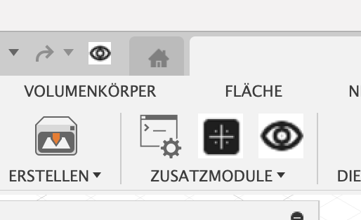
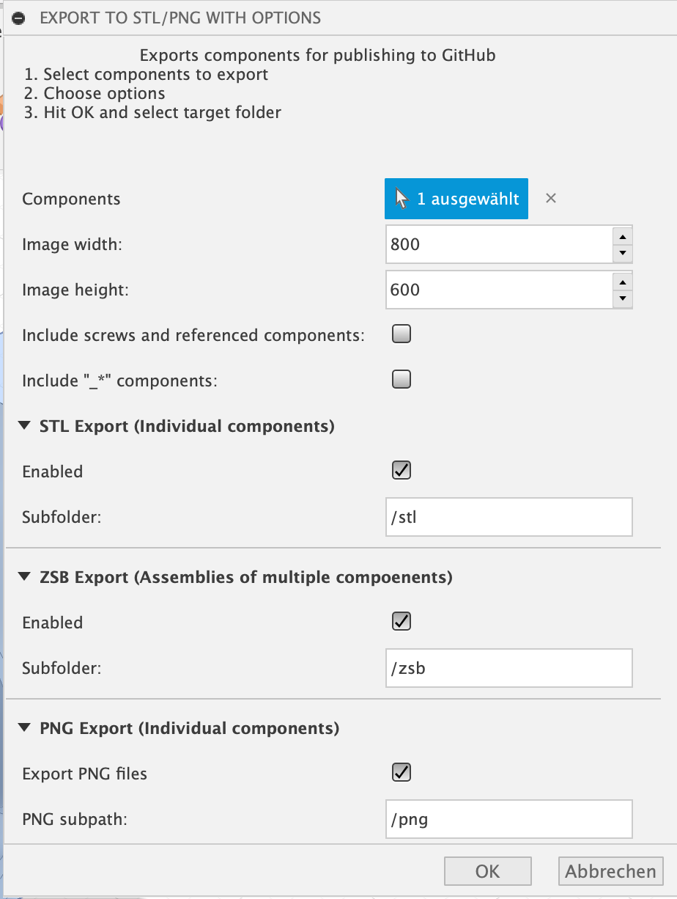

# Auto GitHub Exporter

Automatic exporter for Autodesk Fusion 360 files into the formats commonly used in the author's GitHub projects.

This add-in automates exporting Fusion 360 designs (STL, PNG previews, etc.) and places the results into a folder layout ready to be published alongside project source on GitHub.

## Features

- Export parts and assemblies to common formats (STL and PNG previews)
- Place exported files into a consistent GitHub-friendly folder structure
- Integrates with the Fusion 360 GUI after installation

## Installation

1. Copy the `Auto-GitHub-Exporter` folder into Fusion 360's AddIns directory. Example:

   - macOS: `~/Library/Application Support/Autodesk/Autodesk Fusion 360/API/AddIns/`

2. Start Fusion 360 and enable the add-in from the Add-Ins menu.

## Usage

1. Open the design you want to export in Fusion 360.
2. Start the export via the buttons in the Add-Ins menu or the quick-access toolbar).
3. Choose whether to export all components or only the currently visible components. You can adjust the selection in the following steps.
4. Follow the prompts to pick export targets and an output folder.

The buttons to start the export in the quick access toolbar and the Add-In menu.

### Output
The exporter creates a repository-ready structure with exported binaries and preview images:

- A folder containing one `.stl` file per exported component that contains bodies
- A folder with preview images for each component that contain bodies
- A folder with preview images for each assembly (component comprising of further components) including the full assembly of all components

### Options

After starting an export you can adjust options such as:

- Skip components whose name starts with `_` (useful for clones or mirrored parts)
- Exclude referenced components (for example screws) from export
- Set image dimensions for preview exports
- Define a name for the root if this contains bodies to export

All these settings are saved automatically when an export is started.

Screenshot of the configuration dialog:

## Requirements

- Autodesk Fusion 360 (tested on versions current at development time)
- Python (included in Fusion 360's scripting environment)

## Compatibility

This add-in uses Fusion 360's Python API and should work on platforms where Fusion 360 runs (macOS and Windows). Behavior may vary between Fusion versions due to API changes.

## Development

To develop or extend the add-in:

1. Clone the repository into your Fusion 360 AddIns folder.
2. Edit the Python scripts with your preferred editor.
3. Restart Fusion 360 or reload the add-in to apply changes.

Contributions are welcome.  
See `CONTRIBUTING.md` for details and follow the `CODE_OF_CONDUCT.md` when contributing.

## License

This project is licensed under the MIT License — see `LICENSE.txt`.

## Authors

- Simon Gerlach — https://github.com/Smenger

---

If anything in this README is missing or unclear, please open an issue so we can improve the instructions.
